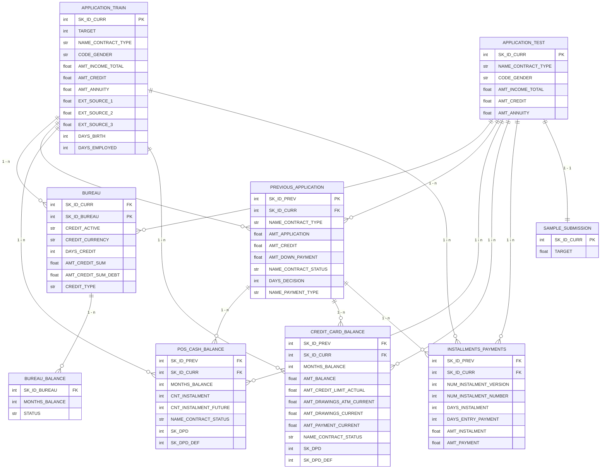

# Home Credit Default Risk — Dataset Overview

Bộ dữ liệu từ cuộc thi Kaggle [Home Credit Default Risk](https://www.kaggle.com/c/home-credit-default-risk). Mục tiêu: dự đoán khả năng khách hàng vỡ nợ dựa trên dữ liệu vay vốn và lịch sử tín dụng.

---

## Entity Relationship Diagram (ERD)



---

## Quan hệ dạng cây

```
application_{train|test} (SK_ID_CURR)
├── bureau (SK_ID_CURR → SK_ID_BUREAU)
│   └── bureau_balance (SK_ID_BUREAU, MONTHS_BALANCE)
├── previous_application (SK_ID_CURR → SK_ID_PREV)
│   ├── POS_CASH_balance (SK_ID_PREV, MONTHS_BALANCE)
│   ├── credit_card_balance (SK_ID_PREV, MONTHS_BALANCE)
│   └── installments_payments (SK_ID_PREV, NUM_INSTALMENT_VERSION)
└── sample_submission (SK_ID_CURR) — chỉ dành cho application_test
```

---

## Chi tiết từng bảng

### 1. `application_train.csv` & `application_test.csv`

Bảng chính, mỗi dòng là một khoản vay.

| File | Kích thước | Số dòng | Số cột |
|------|-----------|---------|--------|
| `application_train.csv` | 158.44 MB | 307,511 | 122 |
| `application_test.csv` | 25.34 MB | 48,744 | 121 |

- **`SK_ID_CURR`**: ID khoản vay (PK).
- **`TARGET`** (chỉ có ở train): 0 = trả nợ tốt (91.9%), 1 = chậm thanh toán (8.1%).
- Các nhóm cột chính:
  - **Nhân thân**: CODE_GENDER, NAME_EDUCATION_TYPE, NAME_FAMILY_STATUS, CNT_CHILDREN, DAYS_BIRTH
  - **Tài chính**: AMT_INCOME_TOTAL, AMT_CREDIT, AMT_ANNUITY, AMT_GOODS_PRICE
  - **Việc làm**: DAYS_EMPLOYED, OCCUPATION_TYPE, ORGANIZATION_TYPE
  - **Tài sản**: FLAG_OWN_CAR, FLAG_OWN_REALTY, OWN_CAR_AGE
  - **Điểm tín dụng ngoài**: EXT_SOURCE_1, EXT_SOURCE_2, EXT_SOURCE_3
  - **Thông tin nhà ở**: APARTMENTS_AVG/MODE/MEDI, BASEMENTAREA_AVG/MODE/MEDI, ...
  - **Flag documents**: FLAG_DOCUMENT_2..FLAG_DOCUMENT_21

---

### 2. `bureau.csv`

Lịch sử vay từ các tổ chức tín dụng khác.

| Kích thước | Số dòng | Số cột |
|-----------|---------|--------|
| 162.14 MB | 1,716,428 | 17 |

- **`SK_ID_CURR`**: FK → application
- **`SK_ID_BUREAU`**: PK (ID khoản vay ở bureau)
- **`CREDIT_ACTIVE`**: Trạng thái (Active, Closed, Sold, ...)
- **`CREDIT_CURRENCY`**: Loại tiền tệ
- **`DAYS_CREDIT`**: Số ngày trước ngày vay hiện tại
- **`AMT_CREDIT_SUM`**: Tổng dư nợ
- **`AMT_CREDIT_SUM_DEBT`**: Dư nợ hiện tại
- **`CREDIT_TYPE`**: Loại tín dụng (Mortgage, Credit card, ...)

---

### 3. `bureau_balance.csv`

Số dư hàng tháng của từng khoản vay ở bureau.

| Kích thước | Số dòng | Số cột |
|-----------|---------|--------|
| 358.19 MB | 27,299,925 | 3 |

- **`SK_ID_BUREAU`**: FK → bureau
- **`MONTHS_BALANCE`**: Tháng (số âm, 0 = tháng gần nhất)
- **`STATUS`**: Trạng thái thanh toán (0-5: số ngày quá hạn, C: closed, X: không có dữ liệu)

---

### 4. `previous_application.csv`

Các đơn vay trước đây của khách hàng tại Home Credit.

| Kích thước | Số dòng | Số cột |
|-----------|---------|--------|
| 386.21 MB | 1,670,214 | 37 |

- **`SK_ID_PREV`**: PK (ID đơn vay trước)
- **`SK_ID_CURR`**: FK → application
- **`NAME_CONTRACT_STATUS`**: Trạng thái đơn (Approved, Refused, Canceled, ...)
- **`AMT_APPLICATION`**: Số tiền yêu cầu
- **`AMT_CREDIT`**: Số tiền được duyệt
- **`DAYS_DECISION`**: Ngày quyết định
- **`NAME_PAYMENT_TYPE`**: Hình thức thanh toán
- **`NAME_GOODS_CATEGORY`**: Loại hàng hóa
- **`CHANNEL_TYPE`**: Kênh bán hàng
- **`SELLERPLACE_AREA`**: Mã vùng người bán

---

### 5. `POS_CASH_balance.csv`

Số dư hàng tháng của các khoản vay POS (mua trả góp) và tiền mặt.

| Kích thước | Số dòng | Số cột |
|-----------|---------|--------|
| 374.51 MB | 10,001,358 | 7 |

- **`SK_ID_PREV`**: FK → previous_application
- **`SK_ID_CURR`**: FK → application
- **`MONTHS_BALANCE`**: Tháng
- **`CNT_INSTALMENT`**: Tổng số kỳ trả góp
- **`CNT_INSTALMENT_FUTURE`**: Số kỳ còn lại
- **`NAME_CONTRACT_STATUS`**: Trạng thái hợp đồng
- **`SK_DPD`**: Số ngày quá hạn
- **`SK_DPD_DEF`**: Số ngày quá hạn (đã định nghĩa)

---

### 6. `credit_card_balance.csv`

Số dư hàng tháng của thẻ tín dụng.

| Kích thước | Số dòng | Số cột |
|-----------|---------|--------|
| 404.91 MB | 3,840,312 | 23 |

- **`SK_ID_PREV`**: FK → previous_application
- **`SK_ID_CURR`**: FK → application
- **`MONTHS_BALANCE`**: Tháng
- **`AMT_BALANCE`**: Số dư
- **`AMT_CREDIT_LIMIT_ACTUAL`**: Hạn mức tín dụng
- **`AMT_DRAWINGS_ATM_CURRENT`**: Rút ATM
- **`AMT_DRAWINGS_POS_CURRENT`**: Rút POS
- **`AMT_PAYMENT_CURRENT`**: Số tiền đã trả
- **`SK_DPD`**: Số ngày quá hạn

---

### 7. `installments_payments.csv`

Lịch sử thanh toán từng kỳ trả góp (bảng lớn nhất).

| Kích thước | Số dòng | Số cột |
|-----------|---------|--------|
| 689.62 MB | 13,605,401 | 8 |

- **`SK_ID_PREV`**: FK → previous_application
- **`SK_ID_CURR`**: FK → application
- **`NUM_INSTALMENT_VERSION`**: Phiên bản kỳ trả
- **`NUM_INSTALMENT_NUMBER`**: Số thứ tự kỳ trả
- **`DAYS_INSTALMENT`**: Ngày đến hạn
- **`DAYS_ENTRY_PAYMENT`**: Ngày thực tế thanh toán
- **`AMT_INSTALMENT`**: Số tiền phải trả
- **`AMT_PAYMENT`**: Số tiền đã trả

➡ **Có thể tính số ngày trễ**: `DAYS_ENTRY_PAYMENT - DAYS_INSTALMENT`
➡ **Có thể tính tỷ lệ trả**: `AMT_PAYMENT / AMT_INSTALMENT`

---

### 8. `sample_submission.csv`

File mẫu để nộp bài trên Kaggle.

| Kích thước | Số dòng | Số cột |
|-----------|---------|--------|
| 0.51 MB | 48,744 | 2 |

- **`SK_ID_CURR`**: ID khoản vay (khớp với application_test)
- **`TARGET`**: Xác suất dự đoán vỡ nợ (0-1)

---

## Feature Engineering gợi ý

### Từ bureau
```sql
-- Số lượng khoản vay ở bureau
COUNT(SK_ID_BUREAU) per SK_ID_CURR

-- Tổng dư nợ
SUM(AMT_CREDIT_SUM_DEBT) per SK_ID_CURR

-- Số khoản vay đang hoạt động
SUM(CASE WHEN CREDIT_ACTIVE = 'Active' THEN 1 ELSE 0 END) per SK_ID_CURR
```

### Từ bureau_balance
```sql
-- Tỷ lệ trạng thái quá hạn
AVG(CASE WHEN STATUS IN ('1','2','3','4','5') THEN 1 ELSE 0 END) per SK_ID_BUREAU
```

### Từ previous_application
```sql
-- Số lần vay trước
COUNT(SK_ID_PREV) per SK_ID_CURR

-- Tỷ lệ đơn bị từ chối
AVG(CASE WHEN NAME_CONTRACT_STATUS = 'Refused' THEN 1 ELSE 0 END) per SK_ID_CURR
```

### Từ installments_payments
```sql
-- Số kỳ trả trễ
SUM(CASE WHEN DAYS_ENTRY_PAYMENT > DAYS_INSTALMENT THEN 1 ELSE 0 END) per SK_ID_CURR

-- Tổng số tiền thiếu
SUM(AMT_INSTALMENT - AMT_PAYMENT) per SK_ID_CURR

-- Số ngày trễ trung bình
AVG(DAYS_ENTRY_PAYMENT - DAYS_INSTALMENT) per SK_ID_CURR
```

### Từ POS_CASH_balance & credit_card_balance
```sql
-- Số ngày quá hạn tối đa
MAX(SK_DPD) per SK_ID_CURR

-- Số dư trung bình (credit card)
AVG(AMT_BALANCE) per SK_ID_CURR
```

---

## Tham khảo

- [Kaggle Competition](https://www.kaggle.com/c/home-credit-default-risk)
- [HomeCredit_columns_description.csv](./HomeCredit_columns_description.csv) — mô tả chi tiết từng cột
